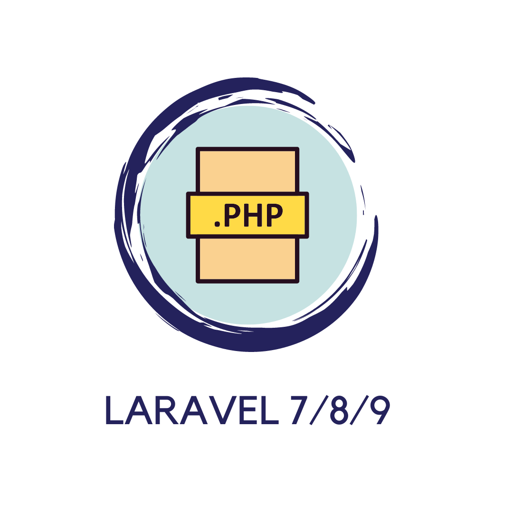
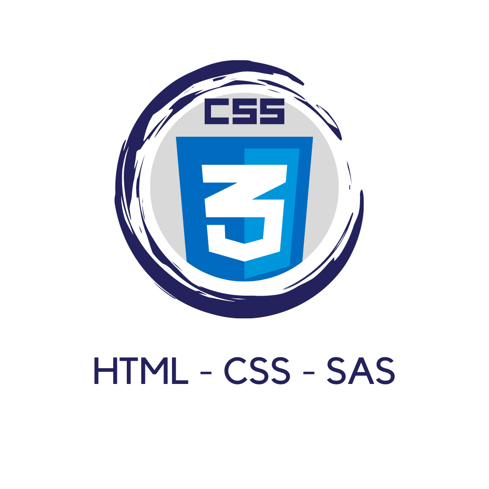

<!-- PROJECT LOGO -->
 

  <h3 align="center">Alan Fabricio Barahona Navarro</h3>

  

    Bienvenido, Soy Alan Barahona programador Back-End, mi punto fuerte es php con Laravel, cuento con catalogo de proyectos utilizando herramientas como: Api's, Sanctum, Fortify. 
     
    <a href="https://github.com/othneildrew/Best-README-Template"><strong>Mis Proyectos »</strong></a>
     
  

  

   
  

  

   
  

