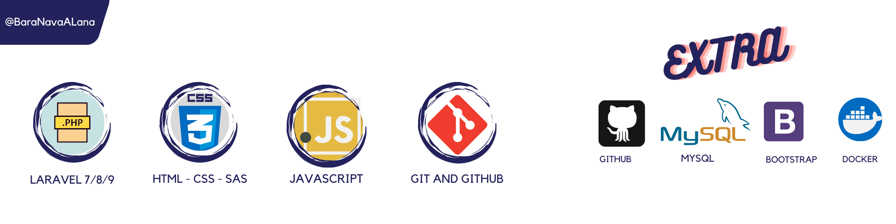

<!-- PROJECT LOGO -->
 

 ## Hola, Soy ALan Barahona  

  
  
💻 Software Developer 
  
  

  

  

 
  

  

    Bienvenido, Soy Alan Barahona programador Back-End, mi punto fuerte es php con Laravel, cuento con catalogo de proyectos utilizando herramientas como: Api's, Sanctum, Fortify. 
    
  

  

   

## Mis estadisticas
  
  

  <a href="https://github.com/BaraNavaALan">
  
    
  
    
    

  ## Idiomas

- [ ] Multi-language Support
    - [x] Español
    - [x] Ingles
    - [x] Frances

(<a href="#top">back to top</a>)
  
    
    
    
## Contacto.

Si deseas contactarme puedes utilizar los enlaces de abajo, dando clic en cualquiera de ellos seras dirijido a una red de mis redes sociales.

 
  
  
 	
   
  
   
 

(<a href="#top">back to top</a>)
    
    